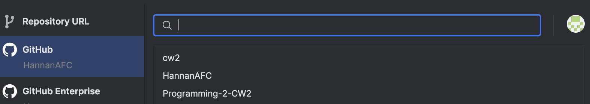
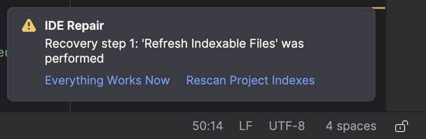
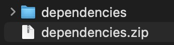

<h1>Programming 2 - Shop Management System (Early)</h1>
<h2><u>Setting up IntelliJ</u></h2>

Install IntelliJ from <a href="https://www.jetbrains.com/idea/download/">here</a>. Select "Clone Repository".

Select "Programming-2-CW2" from the menu, you may have to login to GitHub for this option to show.

The IDE may not let you run the Java files or may not even show the src directory, to fix this, navigate to the hamburger menu -> FIle -> Repair IDE.

Select "Rescan Project Indexes" in the bottom right.

Select "Reopen Project" in the bottom right.

You might have to select your Java SDK as well, this can be done by navigating to the settings menu in the top right -> Project Structure -> Project. Select the SDK dropdown and either select an existing one or select "Download JDK...", this automatically downloads one and selects it for you.

That's it, the project should be runnable now. You'll have to add the libraries below as well.

<h2><u>Dependencies</u></h2>

<a href="https://github.com/HannanAFC/Programming-2-CW2/releases/download/dependencies/dependencies.zip">Download ZIP</a>

To add the dependencies the to project, download the ZIP file and extract it.

The contents should look like this.

In IntelliJ, click on the hamburger menu in the top left -> File -> Project Structure -> Modules and press the plus symbol

Navigate to the where you extracted the dependencies and select all of them.

Next, make sure to check the checkbox for the added libraries and select "apply" and then "Ok".

And that's it. The classes should now be recognised by the IDE.

